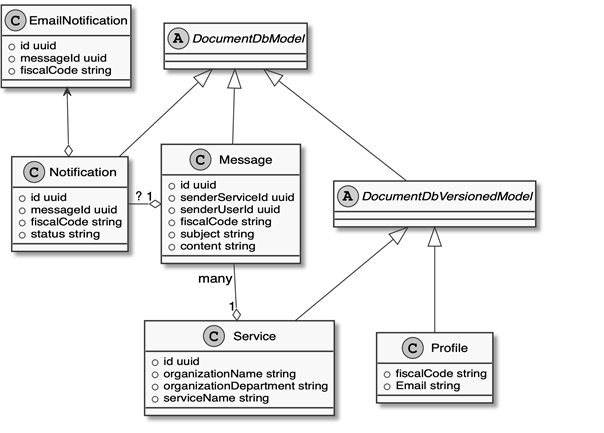

Allegato 4: Domain model del Punto di accesso telematico
########################################################

L'architettura di base prevede i seguenti principali oggetti di dominio.

Profilo
=======
Rappresenta il Profilo di un utente finale, ovvero le sue preferenze. Nel profilo sono raccolti ad esempio:

- il Codice Fiscale;
- l’e-mail;
- eventuali preferenze di notifica espresse tramite l’app (ricezione o 
  meno di e-mail o messaggi di notifica).

Servizio
========
Rappresenta il Servizio in rete. Per i singoli Servizi in rete sono 
raccolte tutte le caratteristiche descrittive del servizio, i riferimenti 
all’organizzazione e al dipartimento che lo emette, l’eventuale presenza 
di pagamenti associati al servizio.

Messaggio
=========
Rappresenta un Messaggio inviato a un utente finale da un Soggetto 
erogatore in relazione a uno specifico Servizio in rete. Il messaggio 
può essere di contenuto testuale e avere o meno un link necessario per 
attivare un relativo pagamento o altra azione da parte dell’utente.

Notifica
========
Rappresenta una notifica all’utente finale, attivata da un Messaggio. 
Una notifica è una comunicazione che viene inviata all’utente finale 
destinatario del Messaggio e che può essere consegnata su più canali. 
Le notifiche hanno funzione di invitare l’utente finale alla lettura 
del relativo messaggio.

Il seguente diagramma Entity Relationship sintetizza il domain model 
del Punto di accesso telematico.

.. forum_italia::
  :topic_id: 22254
  :scope: document
